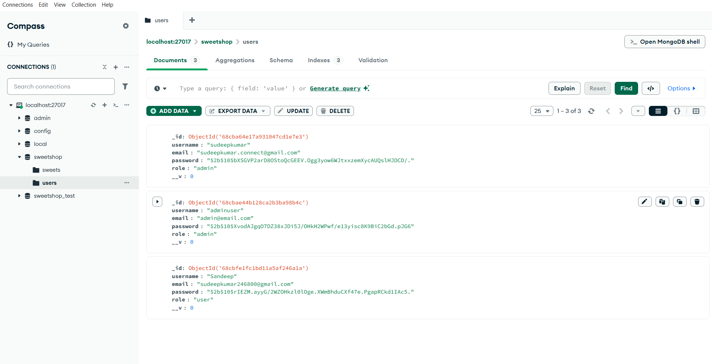

# 🍬 Sweet Shop Management System

## 📌 Overview

Sweet Shop Management System is a full MERN stack application for managing sweets inventory, purchases, and admin operations. It features role-based access for users (browse & purchase) and admins (CRUD sweets, restock, manage inventory). The app is a single-page application (SPA) with a modern, responsive design.

## 🏗️ Initial Project Approach

- **Goal:** Build a robust, scalable sweet shop management system using the MERN stack.
- **Step 1:** Design the database schema for sweets, users, and purchases (MongoDB models).
- **Step 2:** Implement backend REST APIs for authentication, sweets CRUD, and purchase logic (Node.js + Express).
- **Step 3:** Create a modern, responsive frontend SPA (React + Vite) with user and admin modules.
- **Step 4:** Integrate JWT authentication and role-based access control.
- **Step 5:** Add image upload for sweets and error handling throughout the app.
- **Step 6:** Write tests for backend APIs and validate flows with Postman.
- **Step 7:** Polish UI/UX and document the project with screenshots and setup instructions.

## 🗄️ Database Design & Storage

- **Database:** MongoDB (Community edition)
- **Collections:**
  - `users`: Stores user info (username, email, password hash, role)
  - `sweets`: Stores sweet details (name, price, quantity, category, image path)
  - `purchases`: Tracks user purchases (userId, sweetId, quantity, timestamp)
- **Image Storage:** Sweet images are uploaded and stored in the `uploads/` directory, with file paths saved in the `sweets` collection.
- **Seed Data:** Initial sweets data can be loaded using a seed script for demo/testing.

### 📸 Database Snapshot



## 🚀 Features

- User registration & login with JWT authentication
- Role-based authorization (user/admin)
- Browse sweets in a grid with search bar and filters
- Sweets list with product images and real-time quantity
- Out-of-stock sweets are clearly indicated and purchase button is disabled
- Purchase sweets with instant feedback and updated inventory
- Search sweets by name/category
- Admin panel to add, edit, delete, and restock sweets
- Product images displayed in sweet cards
- Seed script to pre-populate sweets data
- Error handling with consistent JSON responses
- Full test suite (Jest + Supertest for backend APIs)
- Screenshots of all major flows (sweets list, out-of-stock, purchase, search, admin, MongoDB data)

## 🛠️ Technologies Used

- **Frontend**: React + Vite (SPA)
- **Backend**: Node.js, Express.js
- **Database**: MongoDB (Community edition)
- **Authentication**: JWT (JSON Web Tokens)
- **Testing**: Jest + Supertest + Postman (API validation)
- **Styling**: Plain CSS (app.css)
- **AI Tools Used**:
  - GitHub Copilot Pro (code scaffolding & auto-complete)
  - ChatGPT (step-by-step guidance, documentation help)
  - StitchAI (UI generation for pages & components)
  - Gemini (idea validation, prompt refinement)
  - AI Image Generator (icons, demo visuals)

## 📂 Project Structure

```
SweetShop/
├── backend/
│   ├── controllers/
│   ├── models/
│   ├── routes/
│   ├── middleware/
│   ├── config/
│   ├── uploads/
│   └── tests/
├── frontend/
│   ├── public/
│   ├── src/
│   │   ├── styles/
│   │   ├── components (JSX)
│   │   └── App.jsx, main.jsx, etc.
│   ├── index.html
│   ├── package.json
│   └── vite.config.js
├── README.md
├── package.json
└── ...
```

## 🏁 Getting Started

### Prerequisites

- Node.js & npm
- MongoDB (local or Atlas)

### Setup Steps

1. **Clone the repository**

```bash
git clone https://github.com/Sudeepkumar0/Sweet-shop.git
cd SweetShop
```

2. **Install dependencies for backend and frontend**

```bash
cd backend
npm install
cd ../frontend
npm install
```

3. **Configure environment variables**

- Create a `.env` file in `backend/` with your MongoDB URI and JWT secret:
  ```env
  MONGO_URI=your_mongodb_uri
  JWT_SECRET=your_jwt_secret
  ```

4. **Seed the database (optional)**

```bash
cd backend
npm run seed
```

5. **Run the backend server**

```bash
npm run dev
```

6. **Run the frontend (Vite) dev server**

```bash
cd ../frontend
npm run dev
```

7. **Access the app**

- Open [http://localhost:5173](http://localhost:5173) in your browser

## 🧪 Testing

- Backend: Run all tests with Jest & Supertest
  ```bash
  cd backend
  npm test
  ```
- API validation: Use Postman collection in `backend/tests/`

## 🖼️ Screenshots

### Sweets List (User Grid)


### Out-of-Stock Sweet


### Purchase Flow


### Search Sweets


### Admin Panel – Image Upload


### Admin Login


### User Login


### User Registration


### MongoDB Data Storage


## 🙌 Credits

- Developed by Sudeepkumar0
- AI Assistance: GitHub Copilot, ChatGPT, StitchAI, Gemini, AI Image Generator
  {
  "email": "your@email.com",
  "password": "yourpassword"
  }

````

Response:

```json
{
  "token": "<JWT token>"
}
````

## Sweets CRUD Endpoints

### Create Sweet (Admin only, with image upload)

**POST** `/api/sweets`
Headers: `Authorization: Bearer <admin_token>`
Body (form-data):
| Key | Type | Example Value |
|----------|-------|---------------|
| name | Text | Ladoo |
| price | Text | 50 |
| quantity | Text | 100 |
| category | Text | Indian |
| image | File | (choose file) |

### List All Sweets

**GET** `/api/sweets`
Returns array of sweets.

### Get Sweet by ID

**GET** `/api/sweets/:id`
Returns single sweet.

### Update Sweet (Admin only)

**PUT** `/api/sweets/:id`
Headers: `Authorization: Bearer <admin_token>`
Body: form-data (fields to update)

### Delete Sweet (Admin only)

**DELETE** `/api/sweets/:id`
Headers: `Authorization: Bearer <admin_token>`

## Inventory Purchase Endpoint

### Purchase Sweet

**POST** `/api/inventory/purchase`
Body (JSON):

```json
{
  "sweetId": "<sweet_id>",
  "quantity": 2
}
```

Response (success):

```json
{
  "message": "Purchase successful",
  "sweet": {
    "_id": "<sweet_id>",
    "name": "Jaleebhi",
    "price": 50,
    "quantity": 8, // updated quantity after purchase
    "category": "Indian",
    "image": "/uploads/1758194813605.jpg"
  }
}
```

Response (out of stock):

```json
{
  "message": "Out of stock"
}
```

## Automated Testing

This project uses **Jest** and **Supertest** for automated backend API testing.

- **Jest**: JavaScript testing framework for running and organizing tests.
- **Supertest**: Library for sending HTTP requests to your Express app in tests.

### Test Setup

- All test files are in `backend/tests/` (e.g., `auth.test.js`, `sweets.test.js`, `purchase.test.js`).
- Tests use a separate test database (`sweetshop_test`) for isolation.
- The app only connects to MongoDB outside of test runs, preventing double connections.

### Running Tests

To run all tests:

```bash
npm test
```

All major API endpoints are covered by tests, including:

- User registration and login
- Sweets CRUD (admin only)
- Inventory purchase logic

Tests automatically check for correct responses, error handling, and database updates.

---

API endpoints can also be tested using Postman or similar tools. Example test images:

### Register Endpoint


### Login Endpoint


### Create Sweet Endpoint


### List Sweets Endpoint


### Update Sweet Endpoint


### Delete Sweet Endpoint


---

Co-authored-by: GitHub Copilot <copilot@users.noreply.github.com>


